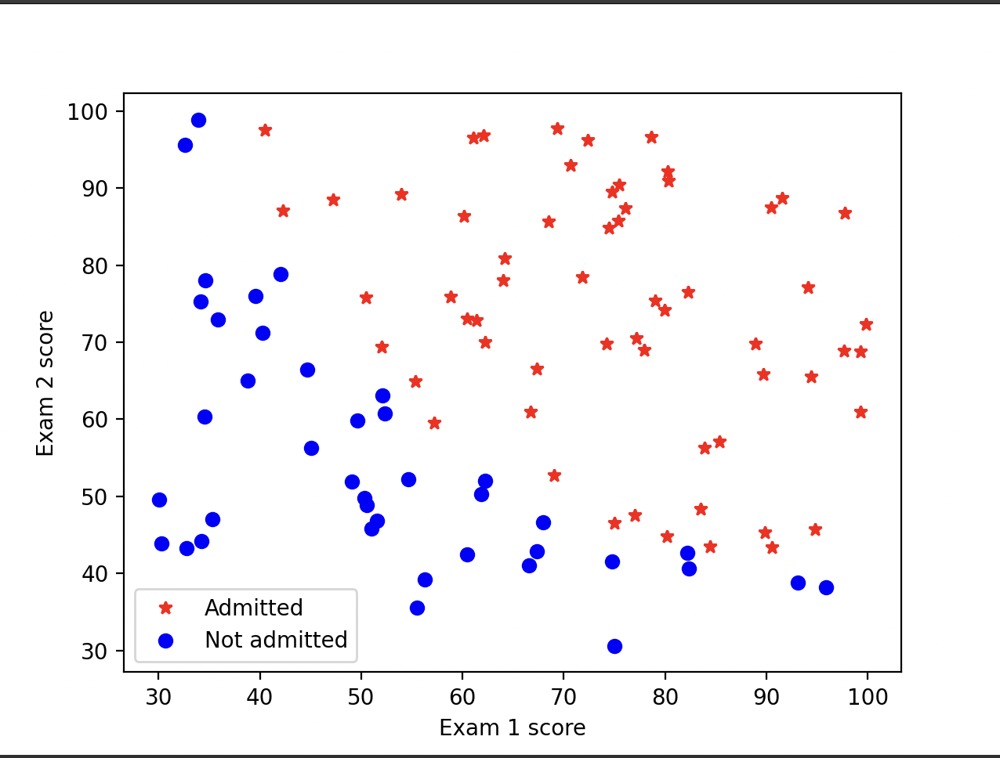
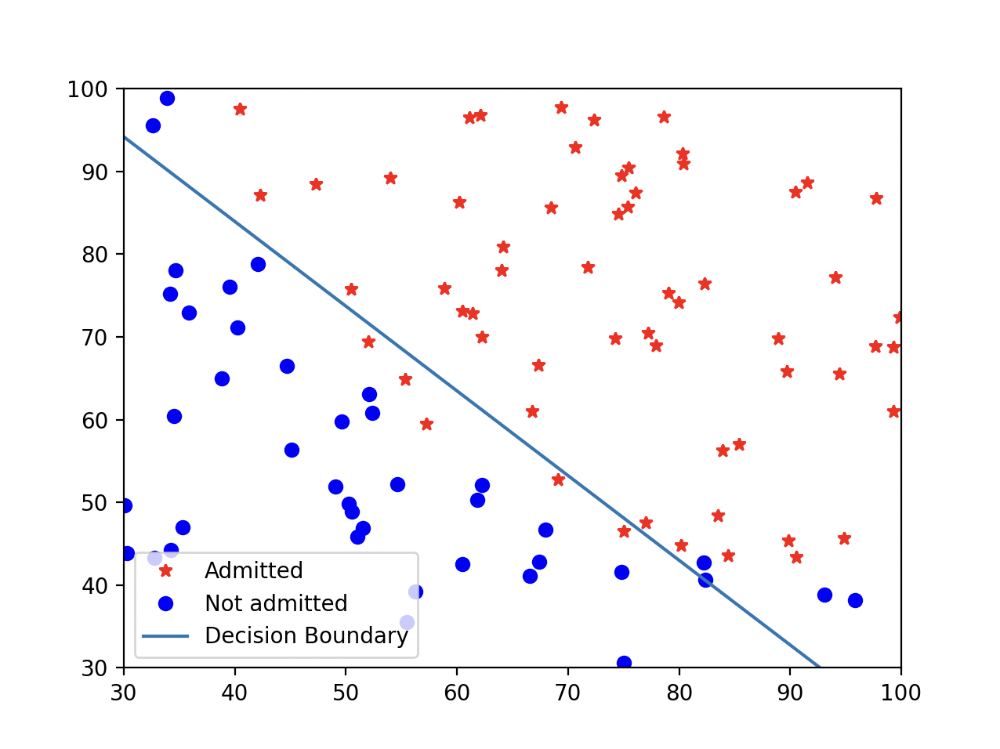
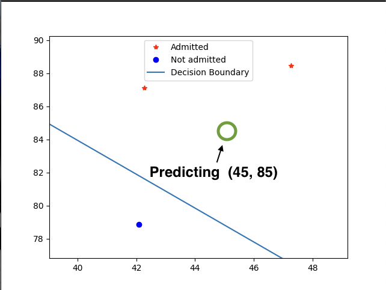

# Part 1 - Logistic Regression

Implemented the missing code in `utils.py` to create a logistical regression model that can predict the class (1-Admitted, 0-Not Admitted) 
for a student based on the data given at `ex2data1.txt`. The data consists of two exam scores and the target label (0 or 1).

Install packages to run `pip install -r requirements.txt`, then run the code to train the model by using `python hw2_logistic.py`.

### Overview

- `plotData()`: Uses matplotlib to show the data along an x and y axis 
for both exam 1 and exam 2 scores, and a red star for the admitted students and a blue circule for the not admitted students. 



- `sigmoid()`: Computes the sigmoid of a given numpy vector.
- `costFunction()`: Compute cost and gradient for logistic regression. `Cost = y * log(h) + (1-y)*log(1-h)`
- Uses scipy.optimize to find the best parameters for the logistical regression model. 
- `plotDecisionBoundary()`: Plots the same data as before, but this time with the desicion boundary generated by the model.



- `predict()`: Run the model to predict the target label for a student with scores (45, 85).

### Output
```
g( 0 ) =  0.5
Cost at initial theta (zeros): 0.693
Gradient at initial theta (zeros):
        [-0.1000, -12.0092, -11.2628]
Cost at test theta: 0.218
Gradient at test theta:
        [0.043, 2.566, 2.647]
/Users/jriveramiranda/Workspace/CSEN240/HW2/hw2_logistic.py:64: OptimizeWarning: Unknown solver options: maxiter
  res = optimize.minimize(costFunction,
Cost at theta found by optimize.minimize: 0.203
theta:
        [-25.161, 0.206, 0.201]
For a student with scores 45 and 85,we predict an admission probability of 0.776
Train Accuracy: 89.00 %
```

# Part 2 - Decision Trees

Using a decision tree model to predict the class (1-Admitted, 0-Not Admitted) for a student with 45 for the first exam and 85 for the second exam. 

The model is located at `decision_trees.py`. Run by simply calling `python decision_trees.py`. 

### Overview
The program will do the following steps:

1. `load_data`: Loads the data from local file `ex2data1.txt` and create a (100x2) numpy matrix `X` and a target numpy vector (100,) `y`.
2. `build_decision_tree`: Builds a descion tree recursively by doing following:
    - `calculate_entropy`: Calculate the entropy at the given node (or root).
        - In this case, entropy is calculated as: `H(Y) = -(p_1 * log2(p1) + p0 * log2(p0))`, where `p_1` is equal to the proportion of 1-Admitted, and `p_0` is equal to the proportion of 0-Not Admitted.
    - If the node entropy is 0, meaning that all the target values are the same, then create a leaf node for that target label.
        - `Node(is_leaf=True, prediction=majority(y_current), ...)`
    - `calculate_threshold_candidates(exam1_features)`: Calculate the midpoints of the consecutive feature values for the Exam 1 scores. For i=0 to n-1, midpoint=(y[i] + y[i+n])/2. These values will be used for testing as the threshold to split the data.
    - `calculate_threshold_candidates(exam2_feature)`: Do the same as above to calculate the midpoints for Exam 2.
    - `calculate_best_information_gain`: For each midpoint for each feature, 
        - `calculate_conditional_entropy`: Calculates the conditional entropy and splits the data using the current feature threshold that we are testing, resulting in `X_top`, `X_bottom`, and `y_top`, and `y_bottom`.
            - The conditional entropy is calculated as `H(Y|X split by theta) = (n_top/n)*H(y_top) + (n_bottom/n)*H(y_bottom)`
        - Calculate information gain as `IG(Y|theta) = H(Y) - H(Y|X split at theta)`, where `H(Y)` is the entropy at the node and `H(Y|theta)` is the conditional entropy based on the split value theta. 
            - `info_gain = base_entropy - conditional_entropy`
        - Keep track of the maximum information gain and the corresponding split data set.
    - Based on the maximum information gain, split the data by the selected threshold into two datasets: (`X_top`, `X_bottom`) and (`y_top`, `y_bottom`).
    - Create a decision node for this split. 
        - `Node(is_leaf=False, feature_index=best_feature_index, threshold=best_threshold)`
    - Recursively start again to build a subtree for the dataset (`X_top`, `y_top`).
    - Recursively start again to build a subtree for the dataset (`X_bottom`, `y_bottom`).
3. `print_tree(`: Print the build decision tree in a human readable format.
4. `predict`Predict the target of a new data point (45, 85) by iterating the tree accordingly.

### Output
```
Loading data from  ex2data1.txt
Calculating midpoints for feature input with dimention (100,)
Calculating midpoints for feature input with dimention (100,)
Base entropy: 0.9709505944546686
For level 2 , the best threshold is  56.746261906407426 for feature 0 . IG: 0.2697300237806306
Calculating midpoints for feature input with dimention (65,)
Calculating midpoints for feature input with dimention (65,)
Base entropy: 0.6900703653284017
For level 3 , the best threshold is  43.11452006339603 for feature 1 . IG: 0.4304210723866662
Calculating midpoints for feature input with dimention (56,)
Calculating midpoints for feature input with dimention (56,)
Base entropy: 0.3013786435930858
For level 4 , the best threshold is  52.400730839267226 for feature 1 . IG: 0.1353275667565358
Calculating midpoints for feature input with dimention (11,)
Calculating midpoints for feature input with dimention (11,)
Base entropy: 0.8453509366224364
For level 5 , the best threshold is  71.48580052225253 for feature 0 . IG: 0.8453509366224364
Calculating midpoints for feature input with dimention (35,)
Calculating midpoints for feature input with dimention (35,)
Base entropy: 0.7219280948873623
For level 3 , the best threshold is  64.02978088788288 for feature 1 . IG: 0.24718229780225043
Calculating midpoints for feature input with dimention (17,)
Calculating midpoints for feature input with dimention (17,)
Base entropy: 0.9774178175281716
For level 4 , the best threshold is  40.347222359601375 for feature 0 . IG: 0.572838961141255
Calculating midpoints for feature input with dimention (9,)
Calculating midpoints for feature input with dimention (9,)
Base entropy: 0.7642045065086203
For level 5 , the best threshold is  45.966265416645335 for feature 0 . IG: 0.31976006206417584
Calculating midpoints for feature input with dimention (4,)
Calculating midpoints for feature input with dimention (4,)
Base entropy: 1.0
For level 6 , the best threshold is  82.9743184708675 for feature 1 . IG: 1.0
Tree built.
Tree structure:
|Exam 1
|- < 56.75:
|  |Exam 2
|  |- < 64.03:
|  |  Leaf: Prediction=0, Proportion=1.00
|  |- >= 64.03:
|  |  |Exam 1
|  |  |- < 40.35:
|  |  |  Leaf: Prediction=0, Proportion=1.00
|  |  |- >= 40.35:
|  |  |  |Exam 1
|  |  |  |- < 45.97:
|  |  |  |  |Exam 2
|  |  |  |  |- < 82.97:
|  |  |  |  |  Leaf: Prediction=0, Proportion=1.00
|  |  |  |  |- >= 82.97:
|  |  |  |  |  Leaf: Prediction=1, Proportion=1.00
|  |  |  |- >= 45.97:
|  |  |  |  Leaf: Prediction=1, Proportion=1.00
|- >= 56.75:
|  |Exam 2
|  |- < 43.11:
|  |  Leaf: Prediction=0, Proportion=1.00
|  |- >= 43.11:
|  |  |Exam 2
|  |  |- < 52.40:
|  |  |  |Exam 1
|  |  |  |- < 71.49:
|  |  |  |  Leaf: Prediction=0, Proportion=1.00
|  |  |  |- >= 71.49:
|  |  |  |  Leaf: Prediction=1, Proportion=1.00
|  |  |- >= 52.40:
|  |  |  Leaf: Prediction=1, Proportion=1.00
Predicting label for student with scores (Exam 1: 45, Exam 2: 85):
Prediction: 1
```

### Compare to logistical regression

Compare with the other model, when we plot the data we can see the tree predicts similarly to the linear regression model.

